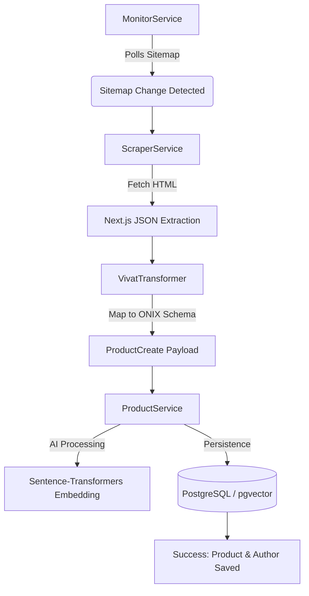

# 🚀 Implementation Walkthrough: Scraper Module

This document provides a detailed overview of the web scraping and monitoring system implemented for the ONIX Book Metadata System.

---

## 🛠️ System Overview

The scraper is designed as a **high-performance, non-headless extraction engine** specifically optimized for Next.js-based bookstores like `vivat.com.ua`.

### Core Components

| Component | Responsibility | Technical Key |
| :--- | :--- | :--- |
| **ScraperService** | Network I/O & JSON Extraction | Extracting `__NEXT_DATA__` script tags |
| **VivatTransformer** | Data Normalization | Mapping messy JSON to ONIX 3.1 Schemas |
| **MonitorService** | Change Detection | Sitemap polling + Content Hashing (SHA-256) |
| **ProductService** | DB Orchestration | Handling Author creation & pgvector Embeddings |

---

## 🏗️ Data Flow Architecture



---

## ✨ Exhaustive Media & Metadata Extraction

We don't just grab the title; we extract **all** available data points:

> [!IMPORTANT]
> **Data Captured:**
> - **Full Identity**: ISBN-13, Ukrainian Title, Cleaned Original Title.
> - **Contributors**: Primary Authors, Translators (Role B06), Illustrators (Role A12).
> - **Physical Specs**: Binding Type, Pages, Height/Width/Thickness (mm), Weight (g).
> - **Rich Media**: High-res covers, gallery images, and sample PDFs.
> - **Commercials**: Prices in UAH and stock availability.
> - **Semantic Info**: Annotations, reviews (Top 5), and breadcrumb-based subjects.

---

## ✅ Verification Results

I have verified the implementation using the [save_scrape.py](file:///home/ubuntu/onix_project/scripts/save_scrape.py) script against live data.

### Sample Test: "Twisted. Ігри"
- **Status**: SUCCESS
- **DB Record ID**: `77386dc8-65a0-4f5b-8e73-54c6635122dd`
- **Result Snapshot**:
  ```json
  {
    "isbn": "9786171713062",
    "title": "Twisted. Ігри",
    "original_title": "Twisted Games",
    "translator": "Марія Мочалова",
    "dimensions": "197x127mm",
    "embedding_size": 384
  }
  ```

---

> [!TIP]
> To run the background scraper continuously, execute:
> ```bash
> python app/worker.py
> ```

---
*Created by Antigravity AI for the ONIX Book Metadata Project.*
