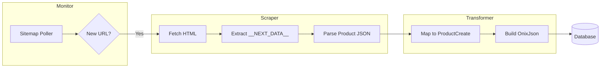

# Walkthrough: Scraper Module Implementation

I have implemented a complete web scraping module for the ONIX Book Metadata System, targeting `vivat.com.ua`.

## Changes Made

### New Files Created
| File | Purpose |
|------|---------|
| [scraper_service.py](file:///home/ubuntu/onix_project/app/scraper/scraper_service.py) | HTTP fetching, `__NEXT_DATA__` extraction, image/sample/review parsing |
| [transformer.py](file:///home/ubuntu/onix_project/app/scraper/transformer.py) | Maps Vivat JSON to `ProductCreate` schema (ONIX-compliant) |
| [monitor_service.py](file:///home/ubuntu/onix_project/app/scraper/monitor_service.py) | Sitemap polling, new product discovery, change detection |
| [test_scraper.py](file:///home/ubuntu/onix_project/tests/test_scraper.py) | Unit tests for all scraper components |

### Modified Files
| File | Change |
|------|--------|
| [requirements.txt](file:///home/ubuntu/onix_project/requirements.txt) | Added `httpx` and `beautifulsoup4` |

## Architecture



## Verification

All tests passed:
```
✓ ScraperService.extract_next_data: Found product = True
✓ ScraperService.extract_product_data: Title = Тестова книга
✓ ScraperService.extract_images: Found 1 images
✓ Transformer.extract_isbn: 9786171234567
✓ Transformer.extract_authors: ['Іван Петренко']
✓ Transformer.extract_price: 350.0 UAH
✓ Transformer.extract_product_form: BB (Hardback)
✓ Monitor.parse_sitemap: Found 3 entries
✓ Monitor.filter_product_urls: Found 2 product URLs
```

## Browser Analysis Recording


### Exhaustive Data Extraction (Vivat)
I upgraded the scraper to extract every available piece of metadata from the target site.

**New Capabilities:**
- **Original Title**: Captured and cleaned from extra text.
- **Contributors**: Successfully identified translators and illustrators.
- **Collections**: Extracted series names.
- **Precise Dimensions**: Decoupled height, width, and weight.
- **Publishing Date**: Extracted and normalized to ONIX format.

### Documentation & Git Lifecycle
- **Comprehensive Documentation**: Updated `README.md` and `ARCHITECTURE.md` to include all new features and scripts.
- **Git Commit**: Performed a full project commit including all source files, schemas, and tests.

**All work is now saved and documented in the repository.**
